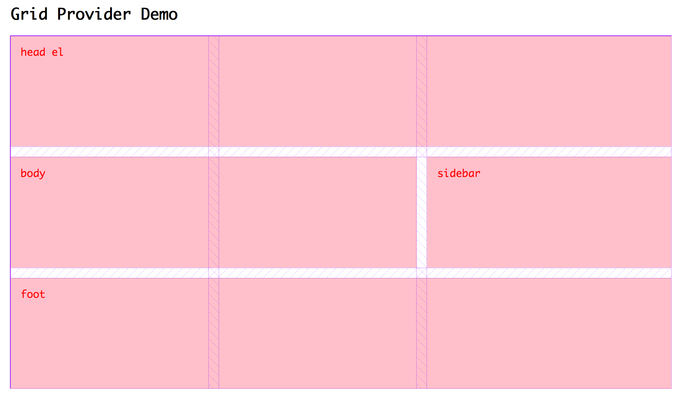

# ⚠️ Don't do this

The resulting api below probably proves that defining grids in CSS makes more sense than a comopnent abstraction.

---

## prototype-grid-providers

Proof of concept for working with CSS Grids in React

### CSS Module
```css
.gridTemplate {
	display: grid;
	grid-gap: 1rem;
	grid-template-areas:
		"head head head"
		"body body sidebar"
		"foot foot foot"
	;
}
.gridArea--head { grid-area: head; }
.gridArea--body { grid-area: body; }
.gridArea--sidebar { grid-area: sidebar; }
.gridArea--foot { grid-area: foot; }

```

### JSX
```jsx
const LayoutGroupHome = createGridProvider(
	gridStyles, // the above CSS imported as a module
	['head', 'body', 'sidebar', 'foot']
);

// ... props are grid area names ...

<LayoutGroupHome
	head={<div className={indexStyles.debug}>head el</div>}
	body={<div className={indexStyles.debug}>body</div>}
	sidebar={<div className={indexStyles.debug}>sidebar</div>}
	foot={<div className={indexStyles.debug}>foot</div>}
/>
```

### Screenshot


## Running in development
`gatsby develop`
